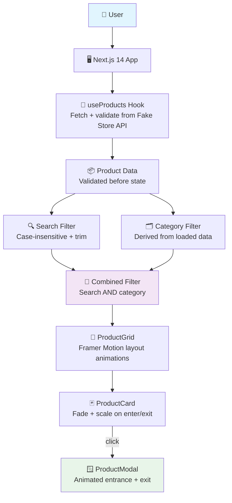
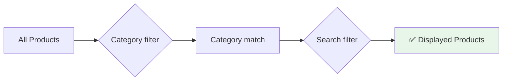

<div align="center">

# 🛍️ Product Explorer

### Next.js · TypeScript · Tailwind CSS · Framer Motion

[](https://nextjs.org/)
[](https://react.dev/)
[](https://www.typescriptlang.org/)
[](https://tailwindcss.com/)
[](https://www.framer.com/motion/)
[](LICENSE)

<br/>

> **A responsive product catalogue with search, category filtering, animated transitions, and product detail modals —**  
> **built without any external UI component library.**

<br/>

[🚀 Quick Start](#-quick-start) · [✨ Features](#-features) · [🏗️ Architecture](#️-architecture) · [🎬 Animations](#-animations) · [📂 Project Structure](#-project-structure)

</div>

---

## ✨ Features

| Feature | Description |
|---------|-------------|
| 🌐 **Fake Store API** | Fetches and validates products at load — no stale mock data |
| 🔍 **Product Search** | Case-insensitive title search with trim before filtering |
| 🗂️ **Category Filtering** | Dynamic categories generated from loaded product data |
| 🔀 **Combined Filtering** | Search + category work together — both conditions must match |
| 🪟 **Product Detail Modal** | Animated modal with image, title, price, description, rating, reviews |
| 🎬 **Framer Motion Animations** | Fade/scale on filter change, smooth modal entrance + exit |
| 📱 **Responsive Grid** | 1 col mobile → 2 col tablet → 3 col desktop |
| ⚠️ **Loading / Error / Empty States** | All three API states handled — no silent failures |
| 🏷️ **Category Normalization** | Frontend-only — API data is never modified |
| ⌨️ **Keyboard-Friendly** | Accessible interactions throughout |
| 🚫 **No UI Library** | Every component is custom — Tailwind only |

---

## 🏗️ Architecture



---

## 🚀 Quick Start

### 1 · Clone the repository

```bash
git clone <your-repository-url>
cd product-explorer
```

### 2 · Install dependencies

```bash
npm install
```

### 3 · Start the development server

```bash
npm run dev
```

Open `http://localhost:3000`

> Requires network access to `https://fakestoreapi.com/products`

---

## 📜 Available Scripts

| Script | Command | Description |
|--------|---------|-------------|
| Development | `npm run dev` | Start Next.js dev server with hot reload |
| Build | `npm run build` | Create optimized production build |
| Start | `npm run start` | Serve the production build |
| Type Check | `npm run typecheck` | TypeScript check without emit |
| Lint | `npm run lint` | ESLint code quality check |

### Validation checklist

```bash
npm run typecheck    # ✅ must pass
npm run lint         # ✅ must pass
npm run build        # ✅ must pass
```

### Deployment checklist

```bash
npm install   
npm run build         
npm run start         
```

---

## 🔍 How Filtering Works

### Search

```text
Input:   "jacket"
Applied: case-insensitive, trimmed
Result:  all products with "jacket" in title
```

### Category

```text
Selected: "men's clothing"
Result:   all products in that category
```

### Combined

```text
Search: "jacket"  +  Category: "men's clothing"
Result: products matching BOTH conditions simultaneously
```



---

## 🎬 Animations

All animations use **Framer Motion** — no CSS-only transitions.

### Product Grid

| Trigger | Animation |
|---------|-----------|
| Product leaves filter result | Fade out + scale down |
| Product enters filter result | Fade in + slide up |
| Products reposition | Smooth layout transition |
| No index-based delays | Stays responsive on full catalogue |

### Product Modal

Animated entrance and exit transitions on open/close — smooth without unnecessary complexity.

---

## 📂 Project Structure

```
product-explorer/
│
├── 📁 src/
│   ├── 📁 app/
│   │   ├── globals.css          # Global styles
│   │   ├── layout.tsx           # Root layout
│   │   └── page.tsx             # Home page
│   │
│   ├── 📁 components/
│   │   ├── Filters.tsx          # Search input + category selector
│   │   ├── ProductCard.tsx      # Animated product card
│   │   ├── ProductGrid.tsx      # Framer Motion layout grid
│   │   ├── ProductModal.tsx     # Animated detail modal
│   │   └── ...
│   │
│   ├── 📁 hooks/
│   │   └── useProducts.ts       # Fetch + validate + state management
│   │
│   └── 📁 types/
│       └── product.ts           # Product type definitions
│
├── package.json
├── tailwind.config.ts
├── tsconfig.json
└── README.md
```

---

## 🛡️ Data & Error Handling

| State | Behaviour |
|-------|-----------|
| **Loading** | Loading state shown while API request is in progress |
| **Error** | Error state shown if request fails or returns unexpected data — no silent failures |
| **Empty** | Empty state shown if no products match the current search + category combination |
| **Validation** | API response is validated before being stored in state — malformed data never reaches the UI |
| **Normalization** | Frontend-only category normalization — original API data is never modified |

---

## ✅ Assignment Coverage

| Requirement | Status |
|---|:---:|
| Next.js / React | ✅ |
| TypeScript | ✅ |
| Tailwind CSS | ✅ |
| Framer Motion | ✅ |
| Fake Store API | ✅ |
| Responsive product grid (1/2/3 col) | ✅ |
| Product search | ✅ |
| Case-insensitive search | ✅ |
| Category filtering | ✅ |
| Combined search + category filtering | ✅ |
| Product detail modal | ✅ |
| Animated transitions | ✅ |
| Loading state | ✅ |
| Error handling | ✅ |
| Empty state | ✅ |
| No UI component library | ✅ |
| Minimal dependencies | ✅ |

---

## 🧱 Tech Stack

| Layer | Technology |
|-------|------------|
| Framework | [Next.js 14](https://nextjs.org/) |
| UI | [React 18](https://react.dev/) + TypeScript |
| Styling | [Tailwind CSS](https://tailwindcss.com/) — custom components only |
| Animations | [Framer Motion](https://www.framer.com/motion/) |
| Data | [Fake Store API](https://fakestoreapi.com/) |

---

<div align="center">

Built with ❤️ by **Alen Thomas**

[](https://github.com/AIstar007)
[](https://www.linkedin.com/in/alen-thomas-3558bb187)

</div>
